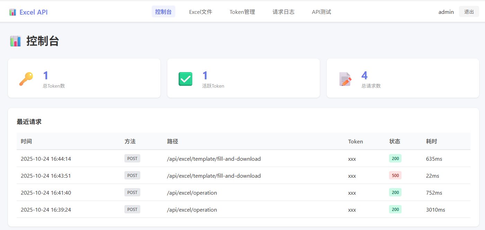
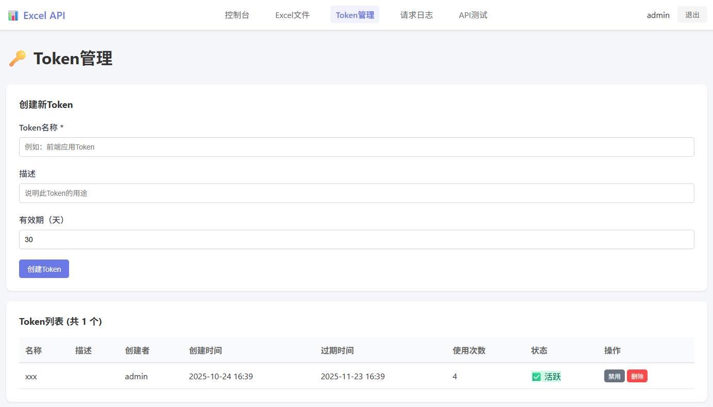
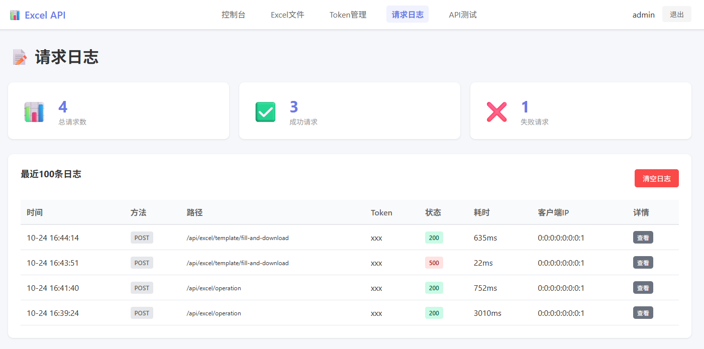
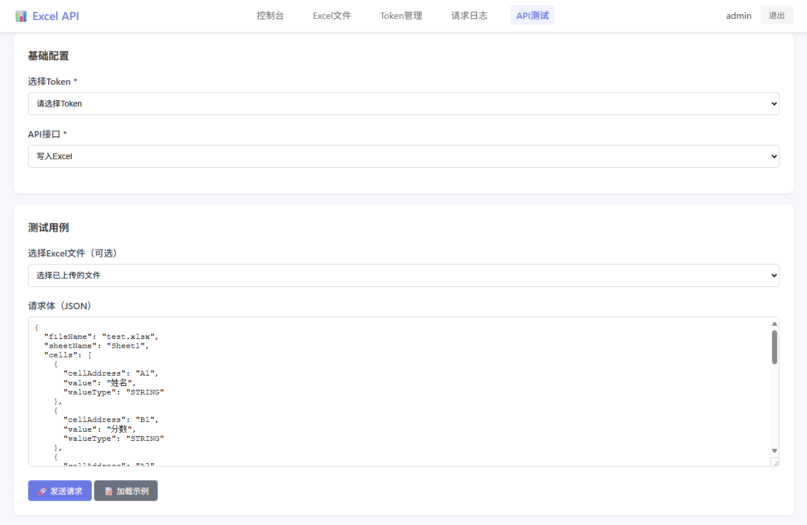

# Excel API Service

bu高可用的Excel公式计算API服务，支持多用户并发读写Excel文件。

> **🇨🇳 中国大陆用户注意**  
> Docker构建前请先配置镜像加速器，否则会超时失败！  
> 📖 查看 **[START_HERE.md](START_HERE.md)** 获取完整步骤（5分钟配置）

## 🚀 功能特性

- ✅ **Excel读写**：支持读取和写入Excel文件（.xlsx格式）
- ✅ **公式计算**：自动计算Excel公式并返回结果
- ✅ **多Sheet操作** 🆕：单次请求可同时操作多个Sheet，支持跨Sheet公式
- ✅ **模板输出** ⭐：基于模板批量生成Excel文件，支持动态填充数据
- ✅ **文件下载**：支持生成后的Excel文件下载导出
- ✅ **Web管理后台** 🆕：
  - 用户登录认证（基于YAML配置）
  - Excel文件管理（上传、下载、删除）
  - API Token管理（创建、启用/禁用、删除）
  - 请求日志查看（实时监控API调用）
  - 在线API测试工具（支持所有8个API接口）
- ✅ **数据库持久化** 💾：Token和日志持久化存储，重启不丢失
- ✅ **Token认证**：所有API请求需要Token验证
- ✅ **并发控制**：支持读写锁，保证数据一致性
- ✅ **分布式锁**：支持本地锁和Redis分布式锁
- ✅ **版本控制**：自动备份Excel文件历史版本
- ✅ **多种数据类型**：支持字符串、数字、布尔值、公式等
- ✅ **RESTful API**：简洁易用的API接口
- ✅ **API文档**：集成Swagger UI

## 🏗️ 架构设计

### 技术栈

- **框架**：Spring Boot 3.2.0
- **Excel处理**：Apache POI 5.2.5
- **数据库**：H2（嵌入式）/ MySQL / PostgreSQL
- **ORM**：Spring Data JPA
- **分布式锁**：Redisson（可选）
- **API文档**：SpringDoc OpenAPI
- **日志**：SLF4J + Logback

### 并发控制策略

1. **读写锁机制**
   - 支持多个线程同时读取同一文件
   - 写入时独占锁，保证数据一致性
   - 基于文件粒度的锁控制

2. **锁类型**
   - **本地锁（Local）**：适用于单机部署，使用`ReentrantReadWriteLock`
   - **分布式锁（Redis）**：适用于集群部署，使用Redisson实现

3. **超时控制**
   - 默认等待锁时间：10秒
   - 默认锁超时时间：30秒

## 📷 系统截图







## 📦 快速开始

### 前置要求

- JDK 17+
- Maven 3.6+
- Redis（可选，用于分布式锁）

### 安装步骤

1. **克隆项目**
```bash
git clone <repository-url>
cd excel-api
```

2. **配置文件**

编辑 `src/main/resources/application.yml`：

```yaml
excel:
  storage:
    path: ./excel-files          # Excel文件存储路径
  lock:
    type: local                  # 锁类型: local 或 redis
```

如果使用Redis分布式锁，配置Redis连接：

```yaml
spring:
  redis:
    host: localhost
    port: 6379
    password: your_password

excel:
  lock:
    type: redis
```

3. **目录初始化**

应用启动时会自动创建以下必需目录：
- `excel-files/` - Excel文件存储
- `excel-temp/` - 临时文件
- `logs/` - 应用日志

> 💡 **提示**: 如果需要自定义路径，请在配置文件中修改相关配置。详见 [DIRECTORY_STRUCTURE.md](DIRECTORY_STRUCTURE.md)

4. **编译运行**

```bash
# 编译
mvn clean package

# 运行
java -jar target/excel-api-1.0.0.jar

# 或使用Maven运行
mvn spring-boot:run
```

4. **访问服务**

```
📊 Web管理后台: http://localhost:18081/admin/login
   默认账号: admin / admin123

💾 数据库控制台: http://localhost:18081/h2-console
   JDBC URL: jdbc:h2:file:./data/excel-api
   用户名: sa
   密码: (留空)

📖 API文档: http://localhost:18081/swagger-ui.html

🏥 健康检查: http://localhost:18081/api/excel/health
```

> 💡 **首次使用建议**: 先登录Web管理后台创建API Token，然后使用Token调用API  
> 💾 **数据持久化**: Token和日志会自动保存到 `./data/` 目录的H2数据库，重启不丢失

### API测试工具

Web管理后台提供了完整的在线API测试工具，支持所有8个API接口：

| 分类 | 接口 | 说明 |
|------|------|------|
| 📝 Excel操作 | 写入Excel | 写入单元格数据、公式 |
| 📝 Excel操作 | 读取Excel | 读取单元格值或公式 |
| 📝 Excel操作 | 写入并读取 | 组合操作，一次完成写入和读取 |
| 📁 文件管理 | 上传文件 | 上传本地Excel文件到服务器 |
| 📁 文件管理 | 下载文件 | 下载服务器上的Excel文件 |
| 📄 模板功能 | 模板生成 | 基于模板生成文件并保存 |
| 📄 模板功能 | 模板填充并下载 | 基于模板生成并直接下载 |
| 🔧 系统 | 健康检查 | 检查服务状态 |

访问路径：`http://localhost:18081/admin/test`

> 📖 详细的API测试教程请查看：[API测试指南](API_TEST_GUIDE.md)

## 🔑 Token认证

所有API请求都需要提供有效的Token。

### 获取Token

1. 登录Web管理后台：http://localhost:18081/admin/login
2. 进入"Token管理"页面
3. 创建新Token并复制保存

### 使用Token

```bash
# 方式1: Header方式（推荐）
curl -H "X-API-Token: tk_your_token_here" \
  http://localhost:18081/api/excel/...

# 方式2: Authorization方式
curl -H "Authorization: Bearer tk_your_token_here" \
  http://localhost:18081/api/excel/...
```

> 📖 详细说明请查看：[Web管理后台使用指南](ADMIN_GUIDE.md)

---

## 📖 API使用示例

### 1. 上传Excel文件

```bash
curl -X POST "http://localhost:18081/api/excel/upload" \
  -F "file=@/path/to/your/file.xlsx" \
  -F "fileName=myfile.xlsx"
```

### 2. 写入数据

```bash
curl -X POST "http://localhost:18081/api/excel/write" \
  -H "Content-Type: application/json" \
  -d '{
    "fileName": "myfile.xlsx",
    "sheetName": "Sheet1",
    "cells": [
      {
        "cellAddress": "A1",
        "value": "产品名称",
        "valueType": "STRING"
      },
      {
        "cellAddress": "A2",
        "value": 100,
        "valueType": "NUMBER"
      },
      {
        "cellAddress": "A3",
        "value": "A1+A2",
        "valueType": "FORMULA"
      }
    ]
  }'
```

### 3. 读取数据（含公式计算）

```bash
curl -X POST "http://localhost:18081/api/excel/read" \
  -H "Content-Type: application/json" \
  -d '{
    "fileName": "myfile.xlsx",
    "sheetName": "Sheet1",
    "cells": [
      {"cellAddress": "A1"},
      {"cellAddress": "A2"},
      {"cellAddress": "A3"}
    ],
    "readFormula": false
  }'
```

响应示例：

```json
{
  "success": true,
  "message": "读取成功",
  "data": [
    {
      "cellAddress": "A1",
      "value": "产品名称",
      "valueType": "STRING"
    },
    {
      "cellAddress": "A2",
      "value": 100.0,
      "valueType": "NUMERIC"
    },
    {
      "cellAddress": "A3",
      "value": 100.0,
      "formula": "A1+A2",
      "valueType": "NUMERIC"
    }
  ]
}
```

### 4. 组合操作（先写后读）

```bash
curl -X POST "http://localhost:18081/api/excel/operation" \
  -H "Content-Type: application/json" \
  -d '{
    "fileName": "myfile.xlsx",
    "writeRequest": {
      "sheetName": "Sheet1",
      "cells": [
        {"cellAddress": "A1", "value": 10, "valueType": "NUMBER"},
        {"cellAddress": "B1", "value": 20, "valueType": "NUMBER"},
        {"cellAddress": "C1", "value": "A1+B1", "valueType": "FORMULA"}
      ]
    },
    "readRequest": {
      "sheetName": "Sheet1",
      "cells": [
        {"cellAddress": "C1"}
      ],
      "readFormula": false
    }
  }'
```

### 5. 模板功能（批量生成报表） ⭐

```bash
# 步骤1：上传模板文件
curl -X POST "http://localhost:18081/api/excel/upload" \
  -F "file=@invoice_template.xlsx"

# 步骤2：基于模板生成并下载
curl -X POST "http://localhost:18081/api/excel/template/fill-and-download" \
  -H "Content-Type: application/json" \
  -d '{
    "templateFileName": "invoice_template.xlsx",
    "downloadFileName": "invoice_2024001.xlsx",
    "sheetName": "Sheet1",
    "cells": [
      {"cellAddress": "B1", "value": "ABC公司", "valueType": "STRING"},
      {"cellAddress": "B2", "value": "INV-2024-001", "valueType": "STRING"},
      {"cellAddress": "B5", "value": 5000, "valueType": "NUMBER"},
      {"cellAddress": "B6", "value": 1, "valueType": "NUMBER"}
    ]
  }' \
  --output invoice_2024001.xlsx
```

> 📖 **模板功能详细说明**：查看 [TEMPLATE_GUIDE.md](TEMPLATE_GUIDE.md) 了解完整的模板使用方法和实际案例

### 6. 多Sheet操作（跨Sheet计算） 🆕

```bash
curl -X POST "http://localhost:18081/api/excel/operation" \
  -H "Content-Type: application/json" \
  -H "X-API-Token: tk_your_token" \
  -d '{
    "fileName": "report.xlsx",
    "writeRequest": {
      "cells": [
        {
          "sheetName": "销售数据",
          "cellAddress": "B1",
          "value": 50000,
          "valueType": "NUMBER"
        },
        {
          "sheetName": "成本数据",
          "cellAddress": "B1",
          "value": 30000,
          "valueType": "NUMBER"
        },
        {
          "sheetName": "利润统计",
          "cellAddress": "A1",
          "value": "净利润",
          "valueType": "STRING"
        },
        {
          "sheetName": "利润统计",
          "cellAddress": "B1",
          "value": "=销售数据!B1-成本数据!B1",
          "valueType": "FORMULA"
        }
      ]
    },
    "readRequest": {
      "cells": [
        {
          "sheetName": "利润统计",
          "cellAddress": "B1"
        }
      ],
      "readFormula": false
    }
  }'
```

> 📖 **多Sheet功能详细说明**：查看 [MULTI_SHEET_GUIDE.md](MULTI_SHEET_GUIDE.md) 了解跨Sheet操作和实际案例

## 🔧 高级配置

### 并发控制

```yaml
excel:
  calculation:
    max-concurrent-reads: 50      # 最大并发读取数
    max-concurrent-writes: 1      # 最大并发写入数
```

### 版本控制

```yaml
excel:
  storage:
    version-control: true         # 启用版本控制
    max-versions: 10              # 保留最多10个历史版本
```

### 锁超时设置

```yaml
excel:
  lock:
    timeout: 30000                # 锁超时时间（毫秒）
    wait-time: 10000              # 等待锁的最大时间（毫秒）
```

## 📊 支持的数据类型

| 类型 | valueType | 说明 | 示例 |
|------|-----------|------|------|
| 字符串 | STRING | 文本数据 | "Hello" |
| 数字 | NUMBER | 数值数据 | 123.45 |
| 布尔值 | BOOLEAN | 真/假 | true |
| 公式 | FORMULA | Excel公式 | "SUM(A1:A10)" |

## 🎯 支持的Excel公式

Apache POI 5.2.5支持约**85%的Excel函数**（~300+函数）：

### ✅ 完全支持（常用）
- **数学函数**：SUM, AVERAGE, MAX, MIN, ROUND, ABS, POWER, SQRT, MOD
- **文本函数**：CONCATENATE, LEFT, RIGHT, MID, LEN, UPPER, LOWER, TRIM
- **逻辑函数**：IF, AND, OR, NOT, IFERROR, IFNA
- **查找函数**：VLOOKUP, HLOOKUP, INDEX, MATCH, OFFSET
- **日期函数**：TODAY, NOW, DATE, YEAR, MONTH, DAY, WEEKDAY
- **统计函数**：COUNT, COUNTA, COUNTIF, SUMIF, AVERAGEIF, MEDIAN

### ⚠️ 部分支持或有限制
- **数组公式**：简单数组公式可用，复杂的可能失败
- **高级统计**：FORECAST, TREND等可能有限制
- **数据库函数**：DSUM, DAVERAGE等支持有限

### ❌ 不支持的函数
- **Excel 365新函数**：XLOOKUP, FILTER, SORT, UNIQUE, TEXTJOIN
- **Web函数**：WEBSERVICE, FILTERXML
- **数据透视**：GETPIVOTDATA
- **OLAP函数**：CUBEVALUE, CUBEMEMBER
- **动态数组**：SEQUENCE, RANDARRAY

> 📖 **详细说明**：查看 [FORMULA_SUPPORT.md](FORMULA_SUPPORT.md) 了解完整的函数支持列表、测试方法和替代方案

## 🏢 部署方案

### 单机部署

使用本地锁即可：

```yaml
excel:
  lock:
    type: local
```

### 集群部署

使用Redis分布式锁：

```yaml
excel:
  lock:
    type: redis

spring:
  redis:
    host: redis-server
    port: 6379
```

配合负载均衡器（如Nginx）实现高可用：

```nginx
upstream excel_api {
    server 192.168.1.101:18081;
    server 192.168.1.102:18081;
    server 192.168.1.103:18081;
}

server {
    listen 80;
    location /api/excel/ {
        proxy_pass http://excel_api;
    }
}
```

### Docker部署

#### 方式1: 一键构建和部署（推荐）

**国际版本**（需要畅通的Docker Hub连接）:

**Linux/Mac**：
```bash
chmod +x docker-build.sh
./docker-build.sh
```

**Windows**：
```cmd
docker-build.bat
```

**国内优化版本**（中国大陆用户推荐）⭐:

**Linux/Mac**：
```bash
chmod +x docker-build-cn.sh
./docker-build-cn.sh
```

**Windows**：
```cmd
docker-build-cn.bat
```

脚本会自动完成：
1. Maven构建jar包
2. 构建优化后的Docker镜像（~200MB）
3. 启动Docker Compose服务
4. 健康检查验证
5. 显示访问地址

**⚠️ 遇到网络超时？** 请查看 [QUICK_FIX.md](QUICK_FIX.md) 或使用国内优化版本脚本

#### 方式2: 手动构建

```bash
# 1. Maven构建
mvn clean package -DskipTests

# 2. Docker构建（使用优化后的Alpine镜像）
docker build -t excel-api:latest .

# 3. 启动服务
docker-compose up -d

# 4. 查看日志
docker-compose logs -f excel-api
```

#### Dockerfile特点

- ✅ **轻量级**：使用 `eclipse-temurin:17-jre-alpine`（~200MB）
- ✅ **快速构建**：本地Maven构建，Docker只负责打包（10-30秒）
- ✅ **JVM优化**：G1GC、容器内存感知、字符串去重
- ✅ **健康检查**：自动监控服务状态

**详细说明**：参见 [DOCKERFILE_OPTIMIZATION.md](DOCKERFILE_OPTIMIZATION.md)

#### docker-compose.yml

已包含完整配置，包括：
- Excel API服务（端口18081）
- Redis服务（端口6379）
- 内部网络配置
- 健康检查
- 数据卷挂载

```bash
# 查看服务状态
docker-compose ps

# 查看日志
docker-compose logs -f

# 停止服务
docker-compose down
```

## 🔒 安全建议

1. **文件路径验证**：限制只能访问指定目录的文件
2. **文件大小限制**：配置最大上传文件大小（默认100MB）
3. **认证授权**：在生产环境中添加Spring Security
4. **防止公式注入**：对用户输入的公式进行验证
5. **HTTPS**：生产环境使用HTTPS协议

## 📈 性能优化

1. **公式缓存**：启用POI的公式计算缓存
2. **并发限制**：合理设置最大并发数
3. **文件池**：考虑实现文件池避免频繁打开关闭
4. **异步处理**：对大文件操作使用异步处理

## 🐛 常见问题

### Q: 公式计算失败怎么办？
A: 检查公式语法是否正确，POI可能不支持某些特殊函数。

### Q: 多个用户同时写入同一文件？
A: 系统会排队处理写入请求，通过写锁保证数据一致性。

### Q: 支持.xls格式吗？
A: 建议使用.xlsx格式，对.xls的支持有限。

### Q: 文件备份在哪里？
A: 备份文件存储在`excel-files`目录下，文件名前缀为`backup_`。

## 📝 开发计划

### 已完成 ✅

- [x] 支持批量操作 ✅ (v1.0.0)
- [x] 添加缓存机制 ⚡ (公式计算缓存)
- [x] 支持Excel模板 ✅ (v1.1.0) - [查看文档](TEMPLATE_GUIDE.md)
- [x] 添加操作审计日志 ✅ (v1.2.0) - 请求日志系统
- [x] Web管理后台 ✅ (v1.2.0) - [查看文档](ADMIN_GUIDE.md)
- [x] Token认证系统 ✅ (v1.2.0)

### 进行中 🚧

- [ ] Token和日志持久化（数据库）
- [ ] 更详细的统计图表

### 计划中 📅

- [ ] 支持更多文件格式（CSV、ODS等）
- [ ] WebSocket实时推送
- [ ] 数据验证规则
- [ ] Token权限细分（读/写权限）
- [ ] API调用频率限制
- [ ] 用户角色权限管理
- [ ] 邮件/Webhook通知

## 📚 文档导航

### 快速开始
- [STARTUP_GUIDE.md](STARTUP_GUIDE.md) ⭐ - **应用启动完整指南**（推荐首读）
- [QUICK_START.md](QUICK_START.md) - 5分钟快速开始指南
- [DOCKER_QUICK_START.md](DOCKER_QUICK_START.md) - Docker快速部署指南
- [QUICK_TEST.md](QUICK_TEST.md) - 快速API测试指南

### API使用
- [API_TEST_GUIDE.md](API_TEST_GUIDE.md) - 完整API测试指南
- [MULTI_SHEET_GUIDE.md](MULTI_SHEET_GUIDE.md) - 多Sheet操作指南
- [MULTI_SHEET_QUICK_START.md](MULTI_SHEET_QUICK_START.md) - 多Sheet快速开始

### 管理指南
- [ADMIN_GUIDE.md](ADMIN_GUIDE.md) - Web管理后台使用指南
- [ADMIN_TEST_MULTI_SHEET_UPDATE.md](ADMIN_TEST_MULTI_SHEET_UPDATE.md) - 管理后台测试工具

### 技术参考
- [FORMULA_SUPPORT.md](FORMULA_SUPPORT.md) - Excel公式支持说明
- [ARCHITECTURE.md](ARCHITECTURE.md) - 系统架构设计文档

### Docker相关
- [DOCKERFILE_OPTIMIZATION.md](DOCKERFILE_OPTIMIZATION.md) - Dockerfile优化详解
- [OPTIMIZATION_SUMMARY.md](OPTIMIZATION_SUMMARY.md) - 优化效果总结
- [PORT_UPDATE.md](PORT_UPDATE.md) - 端口更新说明
- [DOCKER_NETWORK_FIX.md](DOCKER_NETWORK_FIX.md) - Docker网络问题解决
- [START_HERE.md](START_HERE.md) - Docker快速开始指南

### 构建和部署
- [MAVEN_PROFILE_GUIDE.md](MAVEN_PROFILE_GUIDE.md) - Maven Profile使用指南
- [REDIS_CONNECTION_FIX.md](REDIS_CONNECTION_FIX.md) - Redis连接问题解决

### 数据库持久化
- [DATABASE_PERSISTENCE.md](DATABASE_PERSISTENCE.md) - 数据库持久化详细说明
- [PERSISTENCE_QUICK_START.md](PERSISTENCE_QUICK_START.md) - 持久化快速开始

### 故障排查
- [FILE_LIST_TROUBLESHOOTING.md](FILE_LIST_TROUBLESHOOTING.md) - 文件列表故障排查
- [OPERATION_API_FIX.md](OPERATION_API_FIX.md) - /operation API修复说明
- [VALIDATION_FIX.md](VALIDATION_FIX.md) - 参数验证修复说明

### 迁移与更新
- [MIGRATION_GUIDE.md](MIGRATION_GUIDE.md) - 版本迁移指南
- [CHANGELOG.md](CHANGELOG.md) - 完整更新日志
- [PORT_QUICK_SUMMARY.md](PORT_QUICK_SUMMARY.md) - 端口更新快速总结

## 📄 许可证

MIT License

## 🤝 贡献

欢迎提交Issue和Pull Request！

## 📧 联系方式

如有问题，请提交Issue或联系开发团队。

